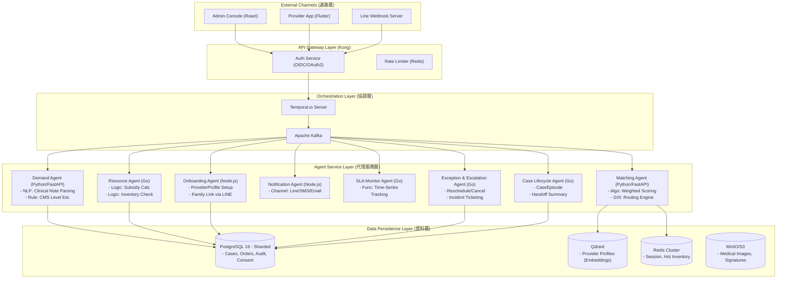

# 1. 系統架構設計 (System Architecture) - Deep Dive

## 1.1 架構概觀 (Architecture Overview)

本系統採用 **Event-Driven Microservices (事件驅動微服務)** 架構，並結合 **Multi-Agent Systems (MAS)** 模式來處理複雜的長照資源協商邏輯。

### 問題導向設計 (Problem-Driven Design)
系統設計對應長照現場的主要結構性痛點：
*   **高齡人口快速成長**：2025 年進入超高齡社會，需求持續上升。[國發會人口推估](https://www.ndc.gov.tw/nc_27_38548)
*   **服務擴張與供給壓力**：112 年長照服務人數 505,020 人，特約單位 8,858 處，規模成長但品質與量能壓力上升。[衛福年報(113) Page 71](https://service.mohw.gov.tw/ebook/dopl/113/01/files/basic-html/page71.html)
*   **人力與區域缺口**：人力短缺與縣市覆蓋落差導致服務不連續。[IJERPH 2021](https://www.mdpi.com/1660-4601/18/2/605)
*   **醫照整合斷點**：醫療與長照治理、資訊系統仍難以銜接。[Ageing & Society 2020](https://www.cambridge.org/core/journals/ageing-and-society/article/abs/longterm-care-system-in-taiwan-the-2017-major-reform-and-its-challenges/BBFFA7C6F73A3EBE2771C1FDA55589B2)

MAS 架構的目標是將「高壓、跨部門、時序長」的長照流程拆解為可監控、可重試、可量化的協作單元，以對應上述痛點。

### 核心設計原則
1.  **鬆散耦合 (Loose Coupling)**: 各 Agent 透過 **Event Bus (Kafka)** 進行非同步溝通，避免單一服務故障導致全系統癱瘓。
2.  **最終一致性 (Eventual Consistency)**: 針對跨系統的狀態同步 (如：HIS 轉介單 status vs. CMS 審核 status)，採用 **Saga Pattern (Orchestration-based)** 確保資料一致。
3.  **人機協作 (Human-in-the-Loop)**: AI Agent 負責初步篩選與推薦，但關鍵決策 (如：核定補助額度、最終派案) 保留人工確認節點。

---

## 1.2 邏輯視圖 (Logical View)

---

## 1.3 技術堆疊決策 (Technology Stack)

| Component | Technology | Rationale (決策理由) |
| :--- | :--- | :--- |
| **Orchestrator** | **Temporal.io** | 原生支援長流程 (Long-running process) 的狀態保存與重試機制 (Retry)，適合長照轉介這種可能跨越數天的流程。 |
| **API Gateway** | **Kong** | 擁有強大的 Plugin 生態 (OAuth2, Rate Limiting, IP Restriction)，且支援 mTLS 這對 HIS 介接至關重要。 |
| **Message Queue** | **Apache Kafka** | 高吞吐量，支援 Event Replay，適合做為系統間的 Event Source of Truth。 |
| **Database** | **PostgreSQL 16** | 支援 JSONB (處理 FHIR 彈性欄位) 與 PostGIS (處理地理資訊媒合)，單一引擎滿足多種需求。 |
| **Vector DB** | **Qdrant** | 用於將服務單位的「專長描述」與個案的「需求摘要」進行向量相似度檢索 (Semantic Search)。 |
| **Frontend** | **Next.js (Web)** / **Flutter (App)** | 統一開發體驗，Next.js 利於 SEO 與 Server-Side Rendering (Dashboard 效能)。 |

---

## 1.4 部署視圖 (Deployment View)

系統部署於 **Hybrid Cloud** 環境，透過 **Kubernetes (K8s)** 進行容器編排。

*   **Public Cloud (AWS/Azure/GCP)**: 部署 Agent 運算節點、前端 Web、Redis Cache。
*   **Government Cloud / On-Premise (NHI VPN)**: 部署敏感資料庫 (DB_Core)、KMS 主金鑰、與衛福部 CMS/HIS 直連的 Gateway 節點。
*   **Connectivity**: 使用 **Site-to-Site VPN** 或 **Dedicated Interconnect** 連接公有雲與政府機房。

### K8s Pod Design
*   **Auto-Scaling**: 設定 HPA (Horizontal Pod Autoscaler)，依據 CPU/Memory 及 Kafka Lag 進行擴縮。
*   **Sidecar Pattern**: 每個 Service Pod 皆注入 **Istio Proxy** 進行 mTLS 加密與 Traffic Observability。

---

## 1.5 事件契約與版本策略 (Event Contract & Versioning)

為確保跨服務演進可控，事件遵循嚴格的契約與相容性規範。

*   **Event Envelope**: 所有事件使用統一欄位 `event_type`, `event_version`, `occurred_at`, `correlation_id`, `payload`。
*   **Schema Registry**: Kafka Topic 需註冊 schema，並採 **backward compatible** 規則。
*   **Replay & Idempotency**: 消費者必須設計為可重放 (idempotent)；事件處理需有去重鍵。
*   **Outbox Pattern**: 服務寫入 DB 與發送事件採用 Outbox，避免雙寫不一致。
*   **Saga Boundary**: 事件發佈與補償交易的邊界需明確標註於 Workflow 定義中。
