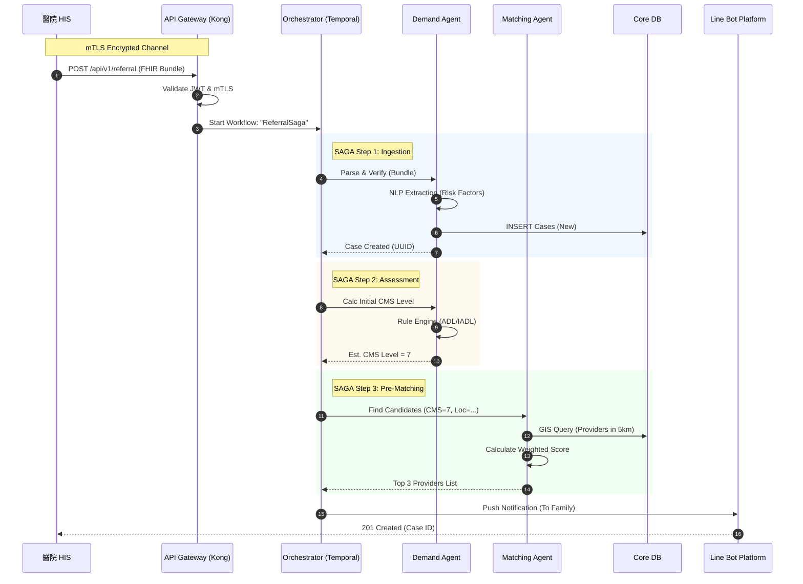
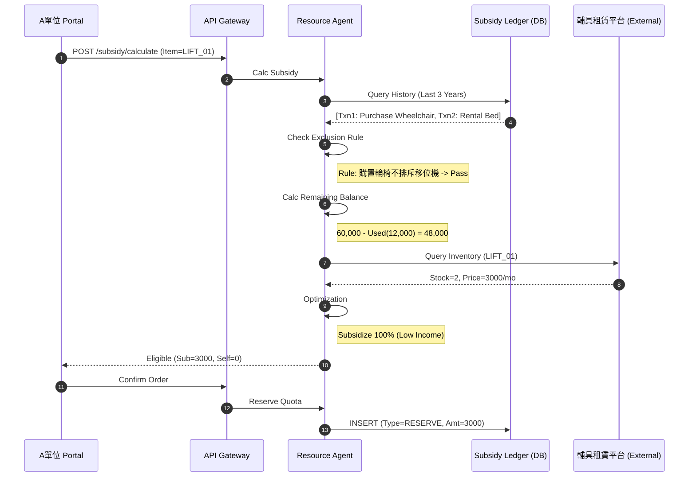
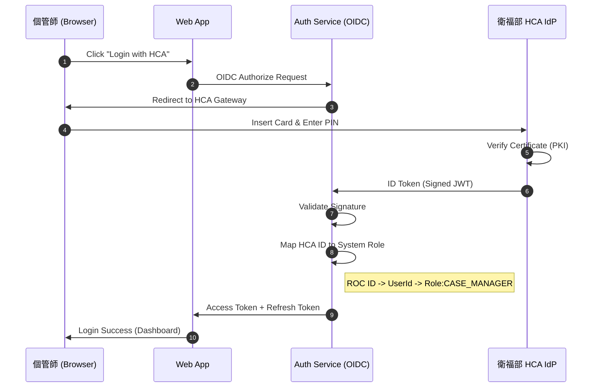

# 4. 關鍵流程時序圖 (Sequence Diagrams)

本章節使用 Mermaid 描述系統關鍵的互動流程，特別著重於 **Saga Transaction** 與 **Multi-Agent 協商**。

## SEQ-01: 出院轉介與自動分案 (Discharge Referral & Auto-Dispatch)

**情境**: 醫院 HIS 發送出院轉介，系統自動建立案件並嘗試首次媒合。

---

## SEQ-02: 智慧輔具租賃額度試算 (Smart Rental Subsidy)

**情境**: 個管師為案主申請「電動移位機」，系統檢查 3 年 6 萬額度。

---

## SEQ-03: 跨機構身分聯邦驗證 (FIdM Authentication)

**情境**: A 單位個管師使用「醫事人員卡 (HCA)」登入系統。

