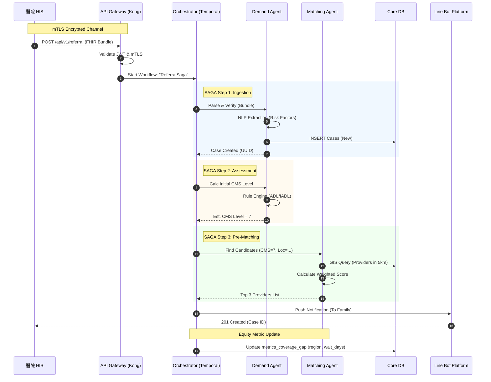
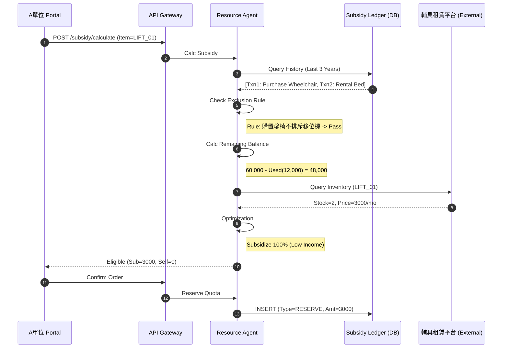
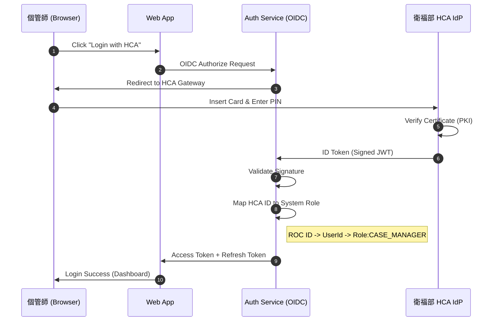
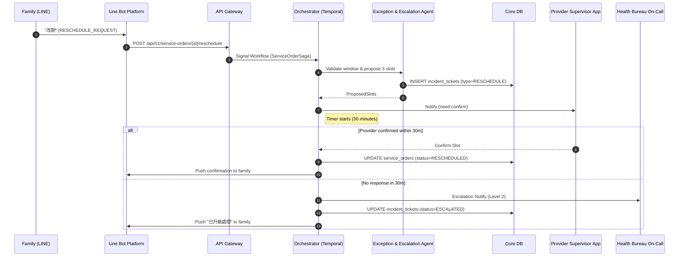
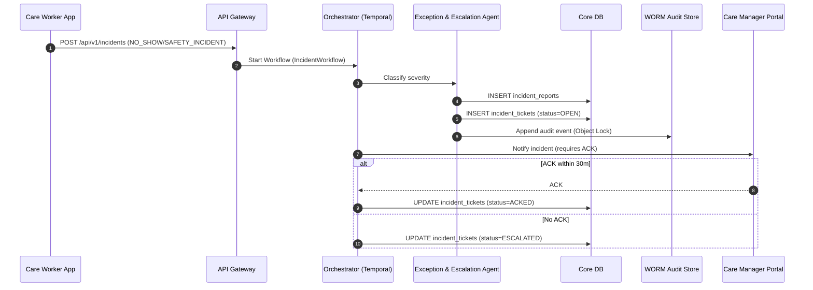
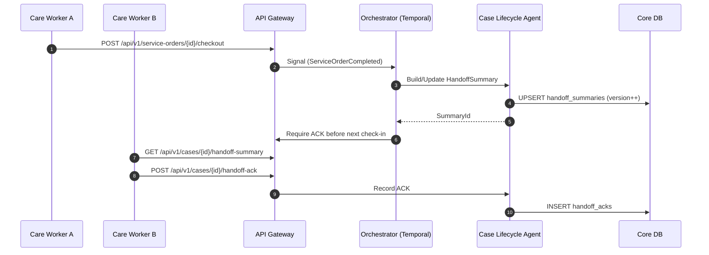

# 4. 關鍵流程時序圖 (Sequence Diagrams)

本章節使用 Mermaid 描述系統關鍵的互動流程，特別著重於 **Saga Transaction** 與 **Multi-Agent 協商**。

## SEQ-01: 出院轉介與自動分案 (Discharge Referral & Auto-Dispatch)

**情境**: 醫院 HIS 發送出院轉介，系統自動建立案件並嘗試首次媒合。

---

## SEQ-02: 智慧輔具租賃額度試算 (Smart Rental Subsidy)

**情境**: 個管師為案主申請「電動移位機」，系統檢查 3 年 6 萬額度。

---

## SEQ-03: 跨機構身分聯邦驗證 (FIdM Authentication)

**情境**: A 單位個管師使用「醫事人員卡 (HCA)」登入系統。

---

## SEQ-04: 改期/取消與升級通報 (Reschedule/Cancel & Escalation)

**情境**: 家屬在 LINE 上提出改期；若 B 單位未在 30 分鐘內確認，系統升級通知衛生局值勤窗口。

---

## SEQ-05: 爽約/安全事件通報與稽核 (No-show & Safety Incident)

**情境**: 居服員到場遇到案家爽約或安全事件，系統建立 IncidentReport 並啟動升級與稽核留存。

---

## SEQ-06: 共案交接摘要產生與確認 (Shared-care Handoff)

**情境**: 同一個案在 7 天內由多位居服員服務，系統在每次服務結束後更新交接摘要；新接手人員需 ACK。

